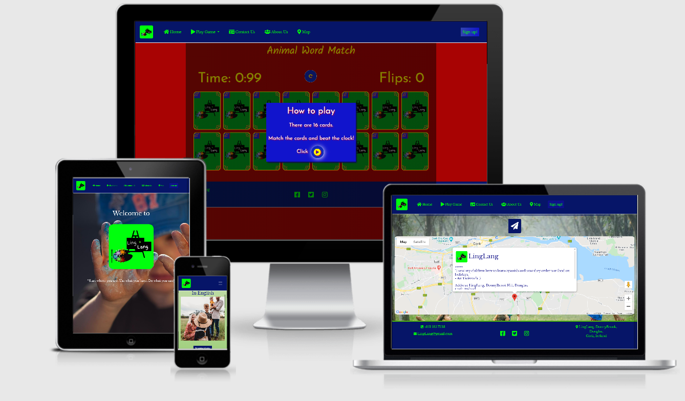
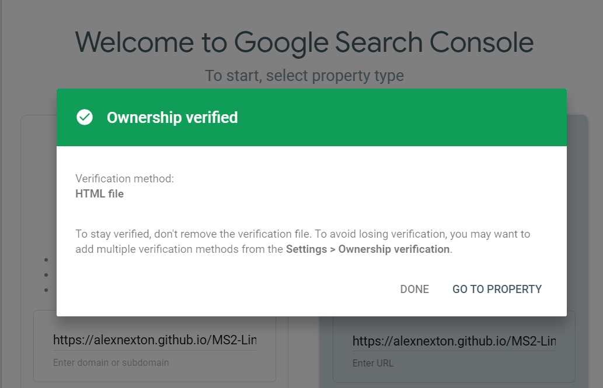
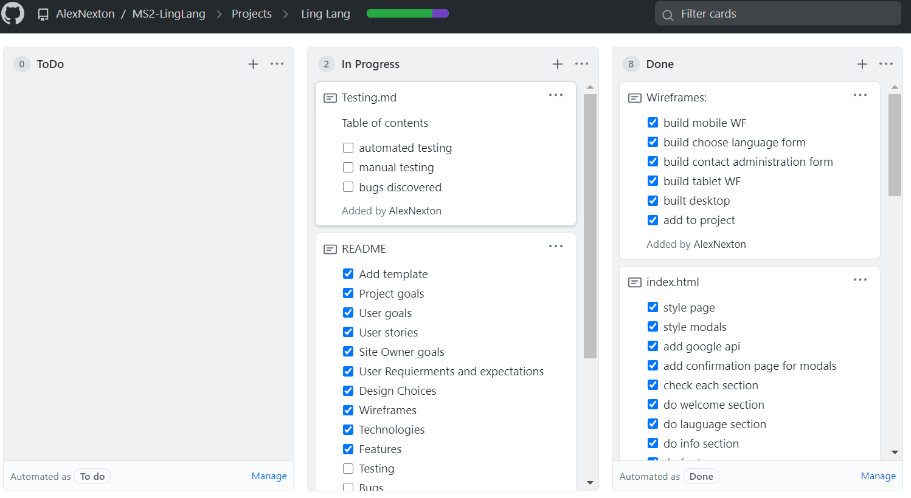

#  #

***LingLang** is an online learning platform where children can learn or continue learning a second or third language through fun games. 
In my professional capacity as a teacher of languages, I designed the website in response to Covid-19 (in 2020) to enable parents to 
continue to provide language lessons while home schooling. Using games and online classes, the idea is to create an online community where
parents and their children can create new social enviornments and become part of a fun new unique way of learning.*


#  #

***Ling Lang's*** *Logo and the website's colours are drawn from the primary and secondary colours (red, blue, green, yellow) so that it appeals to children - especially with regards to the game pages.
The home page is a contrast of those colours so that the site also looks both professional for adults while maintaining a colourful nature for kids.*

## Contents ##

- [Logo](#img-srcwireframeslogo-imagejpg-altlogo)
  - [Contents](#contents)
  - [UX (User Experience)](#ux-user-experience)
  - [Project Goals](#project-goals)
  - [User Goals](#user-goals)
  - [User Stories](#user-stories)
  - [Site Owner Goals](#site-owner-goals)
  - [User Requirements and Expectations](#user-requirements-and-expectations)
  - [Design Choices](#design-choices)
    - [Fonts](#fonts)
    - [Colours](#colours)
    - [Wireframes](#wireframes)
  - [Technologies](#technologies)
    - [Languages](#languages)
    - [Libraries](#libraries)
    - [Tools](#tools)
  - [Features](#features)
    - [Features Implemented](#features-implemented)
    - [Future Features](#future-features)
    [Version Control](#version-control)
    - [Gitpod Workspaces](#gitpod-workspaces)
    - [Branches](#branches)
    - [Working within a branch](#working-within-a-branch)
    - [Merging branches in GitHub](#merging-branches-in-github)
    - [Update Gitpod with the latest GitHub commits](#update-gitpod-with-the-latest-github-commits)
- [Project Management](#project-management)
  - [Testing](#testing)
  - [Bugs](#bugs)
  - [Deployment](#deployment)
    - [Running BI-Team-5 Locally](#running-bi-team-5-locally)
  - [Credits](#credits)
    - [Images](#images)
    - [Colour](#colour)
    - [Image editing](#image-editing)
    - [Acknowledgements](#acknowledgements)
    - [References](#references)


[Table of contents generated with markdown-toc](http://ecotrust-canada.github.io/markdown-toc/)

## UX (User Experience) ##

## Project Goals ##

The **goal** of this project is to build a website which allows LingLang to showcase one of its games in order to help children
 continue learning a second or third language online and after playing it have their parents sign them up to access more levels and other fun games. 
 
## User Goals ##

- **Play**: an interactive game one the site.
- **Contact**: the sites **online** team.
- **Sign up**: select a language to learn so their child will be able to access more games and later be assigned a class.
- **About us**: learn about LingLang, their team and why they started.
- **map** : find the companys location on a map.
- **Link**: to the social media sites.

## User Stories ##

- As a **user**, I want to see a brief **background** story about the site and what it's about.
- As a **user**, I want to know **where** the company is **located on a map**.
- As a **user**, I want to be able to **Sign Up** and **choose a language** for my child/ children.
- As a **user**, I want to be able to **contact** the website's team.
- As a **user**, I want to be able to contact **administration** about payment methods, complaints, general enquires and the language one might choose.
- As a **user**, I want to be able to access the site's if any **Social Media** platforms.
  
****Please note, all the sections in both the sign up and contact forms are mandatory*

- As a **user**, I can play a free game online.
- As a **user**, I can choose the game in three different languages.
- As a **user**, I can see a brief set of instructions on how to play the game.
- As a **user**, I can choose a language for my children to learn.
- As a **user**, I can choose more than one child to participate in a class.
- As a **user**, I can get a **notification** once I've submitted my request and a confirmation message reciting the request is displayed on a new webpage.
- As a **user**, I can **contact** the company for any problems I may encounter using their **social media** channels, **call** or **email** them.
- As a **user**, I can fill out a form with more specific details I wish to discuss if necessary, with the website's team.
- As a **user**, I can learn **about** the site's origin and why they began.

## Site Owner Goals ##

- As a **site owner**, I want to create an interactive website allowing the user to play a game, sign up and make enquires.
- As a **site owner**, I want to create a site that is mobile ready.
- As a **site owner**, I want the user to be able to see a location of the company on google maps.
- As a **site owner**, I want my users to be able to connect with the owner/team via social media channels.
- As a **site owner**, I want my users to be able to sign up to the website.
- As a **site owner**, I want my users to be able to make various inquires - complaint - payment options - General inquiry.
- As a **site owner**, I want my users to be able to play at least three games in three different languages.
- As a **site owner**, I want my users to be able to learn about LingLang.
- As a **site owner**, I want my users to be able to I want a cookie policy displayed and a policy drawn up for users to read.

- Testing information for  **User Stories** can be found in a separate [testing.md](testing.md) file.


## User Requirements and Expectations ##

- **Header**, **Main body** divided into sections and **Footer**.
- In the **Header** we should see a **Logo** and a **navigation bar** across the top or on the left side on moblie with options to go to:
  - **Home** (top of the site)
  - **Play Game**
  - **Contact Us**
  - **About Us** 
  - **Map**
  - **Sign Up**

- In the **Main body** one should see:
  - **Welcome** section with a welcome message.
  - **Try Our Game** displaying a carousel with the language choices.
  - **Sign Up form** to sign up to a class.
  - **Contact Us** section displaying google maps with the company’s location and a form the make various enquires.
- In the **Footer** you should see self-explanatory icons allowing the user to connect them with the companies' social media channels.

 [Back to contents](#contents)
  
## Design Choices ##

### Fonts ###

I chose a couple of font's to work with:

- [Libre Baskerville](https://fonts.google.com/specimen/Libre+Baskerville?query=libre)  mostly for the main site and some of game pages.
- [Josefin](https://fonts.google.com/specimen/Josefin+Sans?query=jose#standard-styles) throughout the game pages.
- [Kalam](https://fonts.google.com/?query=kalam) for game title.
 
### Colours ###

I chose colours that would be appealing to the eye for both adults and children.

- [Color palette for main website](wireframes/style.css.pdf)

- [Color palette for Game Pages](wireframes/GamePagesColours.pdf)

These colours will compliment each other well when used across the site creating a pleasant ambience.

### Wireframes ###

I designed the site mock-ups using [balsamiq wireframes](https://balsamiq.com/). Each image/pdf shows a page and how the displays would change on different screen sizes such as **mobile**, **tablet** and **desktop**.
 
### My Wireframes ###

- [Homepage](/wireframes/HomePage.pdf)
- [About Us page](/wireframes/AboutUsPage.pdf)
- [GamePages](/wireframes/GamePages.pdf)
- [ContactUs](/wireframes/ContactUs.pdf)
- [SignUp](/wireframes/SignUp.pdf)
 
---  
 
## Technologies ##

### Languages ###

- [HTML](https://developer.mozilla.org/en-US/docs/Web/HTML)
- [CSS](https://developer.mozilla.org/en-US/docs/Web/CSS)
- [JavaScript](https://developer.mozilla.org/en-US/docs/Web/JavaScript)

### Libraries ###

- [jQuery](https://jquery.com/)
- [Popper](https://popper.js.org/)
- [Bootstrap](https://getbootstrap.com/)
    - Used to design a mobile-first responsive website layout.
- [Hover CSS](https://cdnjs.cloudflare.com/ajax/libs/hover.css/2.3.1/css/hover-min.css)
  
### Tools ###

- [Git](https://git-scm.com/)
    - Git was used for version control by utilising the Gitpod terminal to commit to Git and push to GitHub.
- [GitHub](https://github.com/)
    - Used to store, host and deploy the project files and source code after being pushed from Git.
- [Gitpod](https://www.gitpod.io/)
    - An online IDE linked to the GitHub repository used for the code development.
- [Google fonts](https://fonts.google.com/)
    - Used for the website fonts.
- [Font-Awesome](https://fontawesome.com/icons?d=gallery)
     - Used for icons to enhance headings and add emphasis to text.
- [Coolors](https://coolors.co/)
    - An online tool used to choose the website colour scheme.
- [Birme](https://www.birme.net/)
    - An online bulk image resizing tool.
- [Favicons](https://favicon.io/)
    - Used to generate a favicon for the website title.
- [Google maps API](https://cloud.google.com/maps-platform/)
    - Used to show the site's location
- [Am I Responsive?](http://ami.responsivedesign.is/)
  - A tool for taking a screenshot of the site and displaying it on various devices to see if it's responsive.
- [Cookie Policy Generator](https://www.cookiepolicygenerator.com/)
    - Used to generate a cookie policy


[Back to contents](#contents)

---

## Features ##

### Features Implemented ###

- Responsive mobile first design using a [Bootstrap](https://getbootstrap.com/) framework.
- User friendly display.
- Navbar with easy navigation that collapses on mobile displays and sticks on desktop.
- Functional Sign Up and Contact Us forms.
- Google maps API for location services.
- An interactive game with bright primary colours.
- Bootstrap accordions to reduce clicks and choose all three games and the instructions.
- Social media links.
  
### Future Features ###

- User accounts to store personal details securely.
  - Personal Profile.
  - Once logged in, the user would have access to a huge variety of games for learning a second or third language.
  - Progress assessment chart to show the user how well they are doing.
- Google Translator.
  - Option to choose one's first language upon loading the site.
- Weekly News letter and challenges for current and future user/clients. 
- Personal Avatar.

---

## SEO ##

Search Engine Optimisation for the site was provided in two complementary ways:
 - XML sitemap file saved in the root directory.
 - Google Search Console.

#### XML Sitemap file ####
- A sitemap.xml file was created to help search engines find, crawl and index the website more easily. 
It was created using[XML-Sitemaps.com](https://www.xml-sitemaps.com/) and entering the URL for the deployed website and letting it automatically generate the required xml data for the entire site.
The file was then saved in the GitHub repository root directory.

- The following steps were used to generate the sitemap.xml file:
  1. Visit [XML-Sitemaps.com](https://www.xml-sitemaps.com/) and enter the URL of the website https://alexnexton.github.io/MS2-LingLang/
  2. Click Start.
  3. The site pages will automatically be scanned.
  4. Click View Sitemap Details.
  5. Download the XML sitemap file.
  6. Save the sitemap.xml file in the root directory of the GitHub repository.

#### Google Search Console ####
- Google Search Console was used to assist with testing and indexing issues with the website and to see how the site performs in Google search results.

- The following steps were used to perform the indexing tests:
  1.  Visit [Google Search Console](https://www.google.com/webmasters/tools/home)
  2.  Click Add Property in the menu bar.
  3.  Enter the website URL https://alexnexton.github.io/MS2-LingLang/
  4.  Click Continue.
  5.  Download the unique verification file created by Google.
  6.  Save the [verification file](google52717a19da9cd4e1.html) in the root directory of the GitHub repository.
  7.  On Google Search Console, click Verify.
  8.  Once the verification passes, the site is available in the Google Search Console dashboard.
     

Even though this website has a small number of pages and has navigation links on each page making the Sitemap largely unnecessary,
a friend of mine inspired me to add **Google Search Console** and **XML Site Map**. Along with the invaluable experience I learned he informed me that it's good practice to add these features in too.


---

## Version Control ##
**Version control** for this repository is managed within **GitHub** and **Gitpod** using separate [branches](https://github.com/AlexNexton/MS2-LingLang/branches)  used to work on specific aspects of the project.
The following describes the repository branch structure:
- **Master** - this is the default branch and the source for the repository deployment.
    - **readme** - this branch is used for updating the README.md and testing.md documentation only.
    - **coc** - (were coc are my initials) this branch is used as the main working branch for the website development

The following workflow steps are used to create and update branches within Gitpod and to push changes back to GitHub.

#### Gitpod Workspaces ####
1. Open **Gitpod** from **Github** using the Gitpod button. This needs to only be done **once** at the start of the project.
2. Start the Gitpod Workspace which opens an **online IDE editor** window.

#### Branches ####
3. For changes to be made to any **readme files**, the git command `git checkout readme` is used to checkout and switch to the **readme branch**.
4. For changes to be made to **other files** under normal site development, the git command `git checkout coc` (where coc are my initials) is used to checkout and switch to the **coc branch**.
5. To create a **new branch**,  use the git command `git checkout -b <branch-name>` to **create and switch** to the new branch.

#### Working within a branch ####
6. **New** or **modified** files are **staged** using the `git add .` command
7. The changes are **committed** using `git commit -m "<commit message>"` command.
8. If the changes are in a newly created branch, the **committed** changes are **pushed** from Gitpod to GitHub using the `git push --set-upstream origin <branch-name>` command as there is currently no upstream branch in the remote repository.
9. For branches that have already been synchronised, the **committed** changes are **pushed** from Gitpod to GitHub using the `git push` command.

#### Merging branches in GitHub ####
10. Opening the repository in Github, a new **pull request** is created for the updated branch and assigned to the **Development project**.
11. The changes are **reviewed** to ensure there are **no conflicts** between the **updated branch** and the **Master branch**.
12. The changes are then **merged** into the **Master branch** and the merge request is **closed**. The **Project entry** is **automatically** moved to the **Done** card.

#### Update Gitpod with the latest GitHub commits ####
13. To update Gitpod with the **latest commits** From GitHub, the `git checkout master` command is used to checkout and switch to the master branch.
14. Use the `git pull` command to update the master branch and **reset the pointer**.
15. Now **switch** to the **other branches** in Gitpod using the `git checkout <branch-name>` command and use the `git merge origin/master` command to **update each branch in turn**.
16. Use the `git push` on **each branch** to update the relevant GiHub Branches to the **same commit** as the **Master branch**.
17. **Repeat steps 3 - 17 regularly** to ensure updates are **saved** and **correctly version controlled** in GitHub.

[Back to contents](#contents)

---

## Project Management ##

GitHub [Projects](https://github.com/AlexNexton/MS2-LingLang/projects) are used to organise the planning and development of the website using the Automated kanban template.
The following project cards are used to manage the tasks:
- **To Do** - this is the current work queue for the project.
- **In Progress** - this is the list of tasks currently in work.
    - New issues and pull requests are automatically added to this column using project card automation options.
- **Done** - completed tasks

Markdown syntax is used to create **"To-Do" list** style checkboxes by adding `- [ ]` for an un-ticked checkbox and `- [x]` for a ticked checkbox on cards as a way of splitting a single complex task into a list of steps to be completed.

    
---

## Testing ##

- Testing information can be found in a separate [testing.md](testing.md) file.

## Bugs ##

- can be found in a separate [testing.md](testing.md) file.

## Deployment ##

The website was developed using both *GitPod* and using *Git* pushed to *GitHub*, which hosts the repository. I made the following steps to deploy the site using *GitHub Pages*:

- Opened up **GitHub** in the browser.
- Signed in with my **username** and **password**.
- Selected my **repositories**.
- Navigated to **AlexNexton/MS2-LingLang**.
- In the top navigation clicked **settings**.
- Scrolled down to the **GitHub Pages** area.
- Selected **Master Branch** from the **Source** dropdown menu.
- Clicked to **confirm** my **selection**.
- [MS2-LingLang](https://alexnexton.github.io/MS2-LingLang/) is now **live** on **GitHub Pages**.

### Running MS2-LingLang Locally ###

Cloning MS2-LingLang from GitHub:

- Navigate to **AlexNexton/MS2-LingLang**.
- Click the green **Clone or Download** button.
- **Copy** the URL in the dropdown box.
- Using your favourite **IDE** open up your preferred terminal.
- **Navigate** to your desired file location.

Copy the following code and input it into your terminal to clone BI-Team-5:

```git clone https://github.com/AlexNexton.MS2-LingLang``

[Back to contents](#contents)

---

## Credits ##

### Images ###

You can find the images used for the site [here](assets/img). I sourced them through various websites, which are free to use:

- [British Council](https://learnenglishkids.britishcouncil.org/flashcards/wild-animals-flashcards) for the game flashcard.
- [Pikrepo](https://www.pikrepo.com/) for the background images and team.
- [Unsplash](https://unsplash.com/) for the background images and team.
- [OurTeam Amy Santiago](https://fordmurraylaw.com/wp-content/uploads/2018/12/Professional-Woman.jpg)
- [OurTeam Terry Jeffords](https://img.freepik.com/photos-gratuite/content-homme-noir-posant-ordinateur-portable_23-2147664280.jpg?size=626&ext=jpg)
- The image for the CEO is mine.
### Colour ###

I have identified the colour palette on [W3](https://www.w3schools.com/).

### Image editing ###

- I used a snippet tool for capturing screengrabs which I saved as images.
-  [Birme](https://www.birme.net/?target_width=300&target_height=300&quality=100&border_width=1&border_color=%23bd3d3a) is a site  that allowed me to resise the images all at once.
---

## Acknowledgements ##

### Personal ###

I would like to take this opportunity to thank a few people who helped me along the way.

 - Firstly, I must give a huge thank you to my friend Simon Vardy, who helped me with testing my code and writing the readme - Simon you are an absolute gentleman, thank you.
   
   To my friend Neringa Bickmore for taking the time to check my code in great detail and giving me some great feedback - thank you.
 
 - Secondly, I want to thank my mother Caroline and uncle Ray for helping me with the UX, wording of content, reading over my project and your constant support. It means the world to me.
 
 - Finally, I want to thank my partner Marta for listening, supporting and believing in me - you are my rock.


### General  ###

- [Stack overflow](https://stackoverflow.com/questions/14977392/bootstrap-carousel-remove-auto-slide) for helping me with almost every JavaScript question I had and fixing bugs.
- [W3Schools](https://www.w3schools.com/) for just being a constant source of help and inspiration!
- [Bootstrap Carousel with Controls](https://getbootstrap.com/docs/4.5/components/carousel/) code.
- [San Francisco State Univerity](https://its.sfsu.edu/projects/resources) PMO Resources webpage where the original UAT Training Plan document was sourced
- [PortEXE ](https://www.youtube.com/watch?v=3uuQ3g92oPQ) This tutorial helped with writing the game and understanding JavaScript a whole lot more. 
- [zapsplat ](https://www.zapsplat.com/sound-effect-category/button-clicks/) Used their sounds for the Card game.

### References ###

- [PortEXE ](https://www.youtube.com/watch?v=3uuQ3g92oPQ) This tutorial helped with writing the game and understanding JavaScript a whole lot more. 
- [Web Dev Simplified](https://www.youtube.com/watch?v=28VfzEiJgy4) This tutorial helped with writing the CSS for the card game and opening my eyes to the power of CSS. 
- [Cookie Policy](https://www.cookiepolicygenerator.com/) generated the cookie policy for the site.
- [Logo design](https://www.freelogodesign.org/) I used this site to make LingLang's logo

[Back to contents](#contents)
 
---
