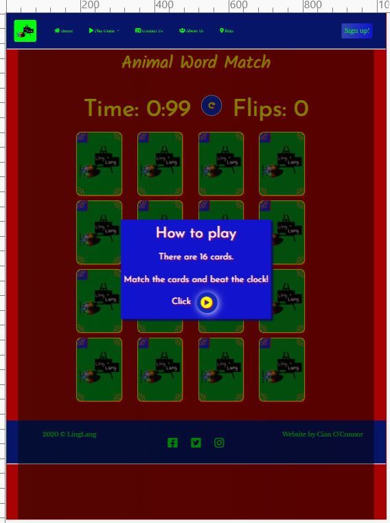

#  #

# MS2-LingLang Testing Details #

[Main README.md file](https://github.com/AlexNexton/MS2-LingLang/blob/master/README.md)

[View the live project here.](https://alexnexton.github.io/MS2-LingLang/)

---

## Table of Contents ##

- [Automated Testing](#automated-testing)
  - [Validation Services](#validation-services)
- [Manual Testing](#manual-testing)
  - [User Acceptance Testing (UAT)](#user-acceptance-testing-(uat))
  - [Testing undertaken on desktop](#testing-undertaken-on-desktop)
  - [Testing undertaken on tablet and phone devices](#testing-undertaken-on-tablet-and-phone-devices)
- [Bugs discovered](#bugs-discovered)
  - [Unsolved Bugs](#unsolved-bugs)

---
## Automated Testing ##
---

### Validation Services ###

The following **validation services** and **linter** were used to check the validity of the website code.

- [W3C Markup Validation](https://validator.w3.org/) was used to validate HTML.
- [W3C CSS validation](https://jigsaw.w3.org/css-validator/) was used to validate CSS.
- [JSHint](https://jshint.com/) was used to validate JavaScript.

---
## Manual Testing ##
---

### User Acceptance Testing (UAT) ###
[UAT document](testing/MS2-ABear-uat-test-plan.pdf) containing:
- UAT approach (scope, assumptions and constraints, team roles and responsibilities etc.), 
- Identified risks, 
- The test cases,
- The pass / fail record for each test case.

### Testing undertaken on desktop ###

- Hardware:
    - Macbook Pro Laptop
    - Dell 5590 Laptop
- Tested Operating Systems:
    - Windows 10
    - OSX 10.11          
- Tested Browsers:
    - Windows 10:
        - Chrome
        - Firefox
        - Edge 
    - OSX 10.11
        - Chrome
        - Firefox
        - Safari  

### Testing undertaken on tablet and phone devices ###

- Hardware:
    - iPad Pro 12.9"
    - iPad Pro 10.5"
    - iPhone XS Max
- Tested Operating Systems:
    - iOS 13.5.1
    - iPadOS 13.5.1
- Tested Browsers:
    - iOS / iPadOS
        - Chrome
        - Firefox
        - Edge

---
## User Stories Testing ##
---

- As a **user**, I can play a free game online. 

  As a **user**, I can see a brief set of instructions on how to play the game.

  As a **user**, I can choose the game in three different languages

    1. Go to the Home page (or from any page).
    2. Looking at the Nav-bar, click the 'PlayGame'.
    3. Choose **instruction** to see how to play the game or choose **In English, French or Spanish** to go directly and play the game.

-  As a **user**, I want to see a brief **background** story about the site and what it's about.
  
   As a **user**, I can learn **about** the site's origin and why they began. 

    1. Go to the Home page (or from any page).
    2. Looking at the Nav-bar, click the 'About Us' page.
    3. Scroll down until you see **'What We're About'** and **'How We Began'**.

-  As a **user**, I want to know **where** the company is **located on a map**.

    1. Go to the Home page (or from any page).
    2. Looking at the Nav-bar, click 'map'.
    3. The user will be brought to a google maps with LingLangs location.

- As a **user**, I want to be able to **Sign Up** and **choose a language** for my child/ children.

  As a **user**, I can choose a language for my children to learn.

     1. Go to the Home page.
     2. Looking at the Nav-bar, click 'Sign Up'.
     3. A modal will appear instantly.
     4. Fill in your detatils and choose a language.
     5. Choose either **English, French or Spanish**.
     6. Submit.

 - As a **user**, I can choose more than one child to participate in a class.

     1. Go to the Home page.
     2. Looking at the Nav-bar, click 'Sign Up'.
     3. A modal will appear instantly.
     4. Fill in your detatils and 'No of Children - Max 4'.
     5. Choose either **1, 2, 3 or 4**.
     6. Submit.

- As a **user**, I want to be able to **contact** the website's team.

     1. Go to the Home page.
     2. Looking at the Nav-bar, click 'Contact Us'.
     3. A modal will appear instantly.
     4. Fill in your details.
     5. Click ' inquire about' and select 'LingLangs team'.
     6. Once the form is completed, click the arrow to submit.
    
- As a **user**, I want to be able to contact **administration** about payment methods, complaints, general enquires and the language one might choose.
 
  As a **user**, I can get a **notification** once I've submitted my request and a confirmation message reciting the request is displayed on a new webpage.

     1. Go to the Home page.
     2. Looking at the Nav-bar, click 'Contact Us'.
     3. A modal will appear instantly.
     4. Fill in your details.
     5. Click ' inquire about' and select 'LingLangs team'.
     6. Once the form is completed, click the arrow to submit.
     7. A confirmation page will come up where the user can fill out a more detailed form if necessary.

- As a **user**, I want to be able to access the site's if any **Social Media** platforms.

    1. Go to the Home page.(or any page).
    2. Scroll down to the very bottom.
    3. Click either Facebook, Twitter or Instagram.

- As a **user**, I can **contact** the company for any problems I may encounter using their **social media** channels, **call** or **email** them.

    1. Go to the Home page.(or any page).
    2. Scroll down to the very bottom.
    3. In the footer you have Contact information - Email, Address and Phone Number.

        or

        1. Go to the Home page.
        2. Looking at the Nav-bar, click 'Contact Us'.
        3. A modal will appear instantly.
        4. Fill in your details.
        5. Click ' inquire about' and select 'General inquiry'.
        6. Once the form is completed, click the arrow to submit.

- As a **user**, I can see some of **The Team** .

    1. Go to the Home page.
    2. Looking at the Nav-bar, click 'About Us'.
    3. Scroll down until you see **Our Team**.

#### Bugs ####

- Start button on game when clicked more than once would increment the countdown timer on the clock.
  - I had to remove the start button and have the page refresh instead.

- The overlays for each game, which appear before you start the game or upon completion would disappear without starting the game if you clicked anywhwere on the screen.
    - I figured out how to make it so the only way to remove the overlay was by clicking the play/refresh button. Thereby leaving the game static.

- With [EmailJS](https://www.emailjs.com/) I couldn't get the emails to send over a modal form.
    - I moved the form to the contact confirmation page which I used as a quick solution however, I would have rathered it send the modal contents to the user's email address.

- In the beginning the cards for the game only matched the same link.
    - I figured out how to match them to different links thereby making it possible to have the pictures match their
     corresponding words thanks to [StackOverFlow](https://stackoverflow.com/).

#### Unsolved Bugs ####

The bottom of the screen on the each game page for the **ipad pro** on **Google dev tools** goes beyond the footer.

